# NYC TLC Data Lakehouse Project

## Overview

This project demonstrates an **end-to-end data engineering pipeline** built using a **Medallion (Bronze–Silver–Gold) architecture**. It processes NYC Taxi and Limousine Commission (TLC) trip data, performs heavy transformations, models the data, and visualizes insights.

**Key Components**

* **Storage:** MinIO (S3-compatible object storage)
* **Processing:** Apache Spark (heavy transformations)
* **Table Format:** Apache Iceberg with Nessie catalog
* **Metastore:** PostgreSQL
* **Modeling:** dbt (with Trino)
* **Visualization:** Apache Superset
* **Automation:** Shell scripts for platform management (`up` / `down`)

---


* **Raw Layer:** Raw data stored in MinIO as Parquet.
* **Bronze Layer:** Raw data registered as Iceberg tables using Spark.
* **Silver Layer:** Cleaned and pre-processed data (Spark + Iceberg).
* **Gold Layer:** Aggregated and modeled data via dbt for analytics and dashboards.

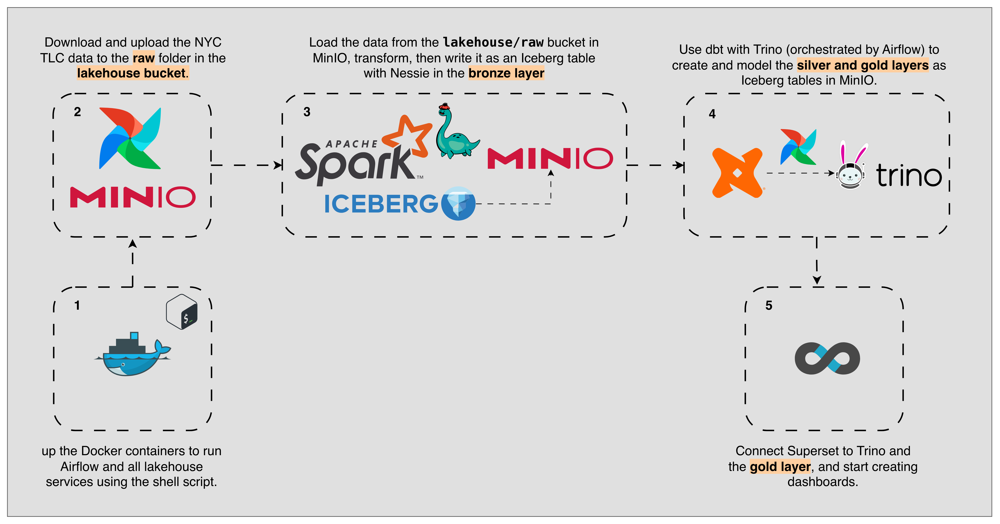

---
## MinIO

The raw data (three months due to hardware limitations) is stored in the `lakehouse` bucket as Parquet files.

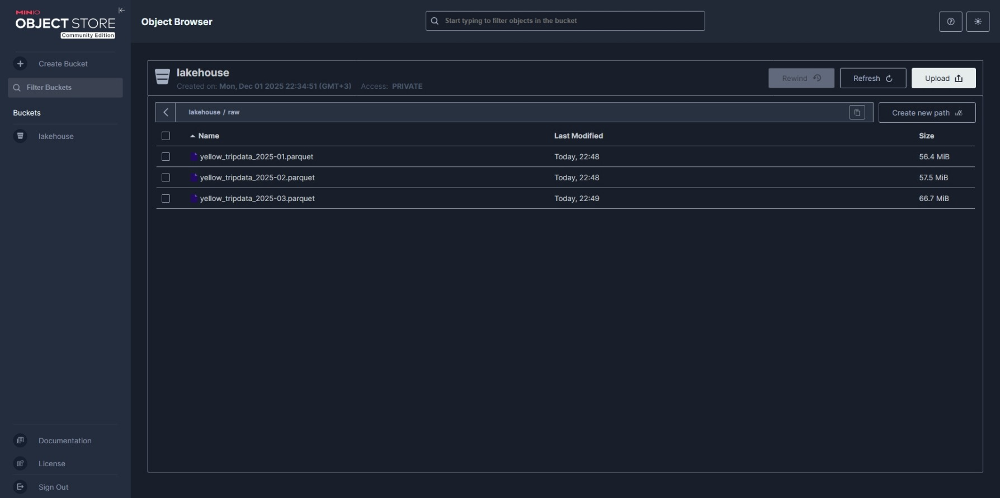

The bucket contains:

* Raw Parquet files
* Iceberg Bronze tables

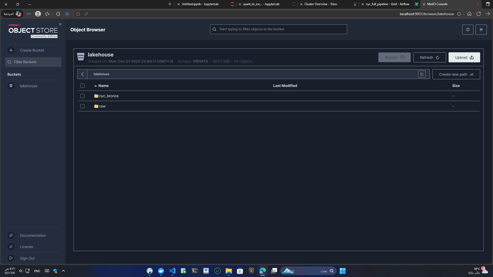

---
Nessie is an open-source, Git-like catalog for Apache Iceberg. It provides **branches, tags, and version control** for lakehouse tables.

In this project, **PostgreSQL** is used as the Iceberg metadata store.

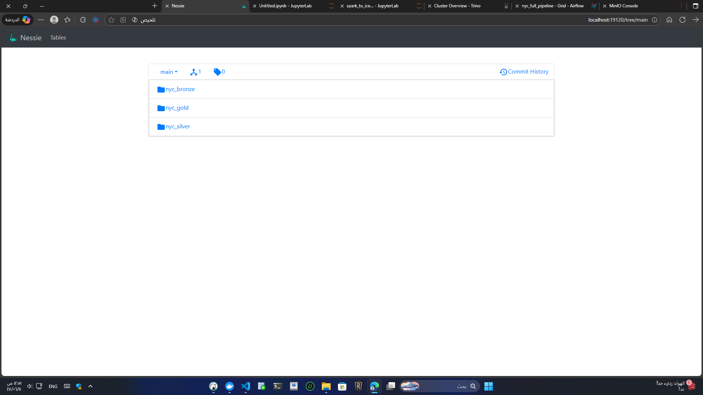

How Nessie stores tables:

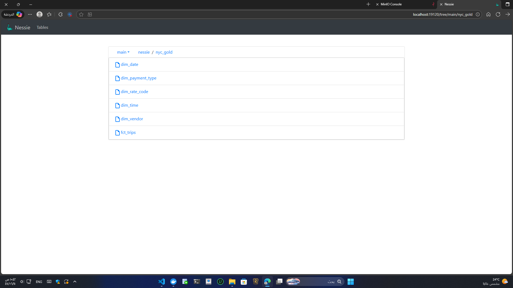

Metadata location inside MinIO:


Commit logs:

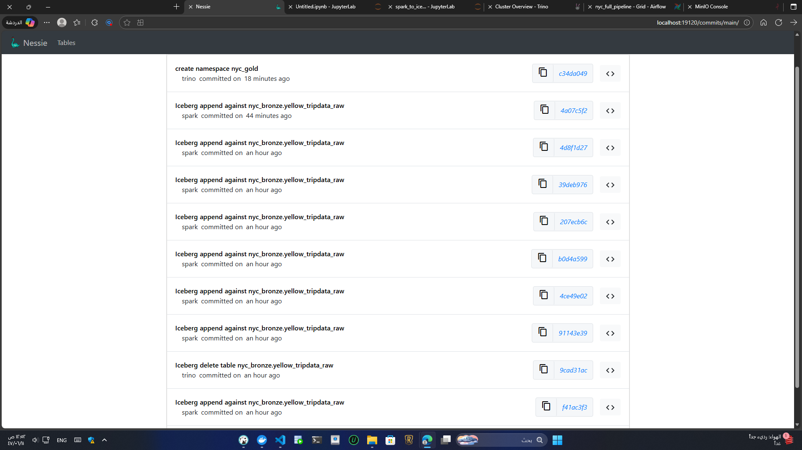

Connection to Trino + Nessie from DBeaver:

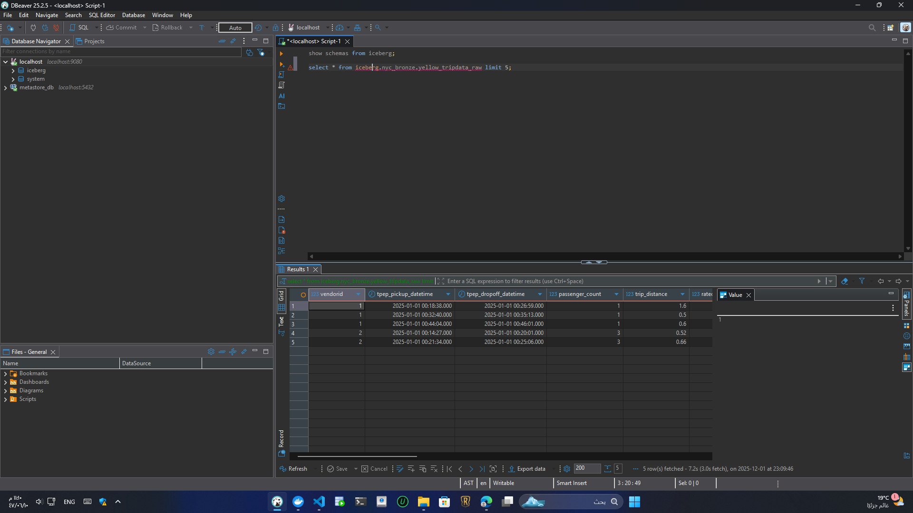

---
## Spark

Spark performs heavy transformations. Trino caused **OOM (Out of Memory)** errors when processing the data, so Spark was used to:

* Ingest data month-by-month
* Partition Iceberg tables by month
* Avoid memory pressure

Spark → Nessie write integration through Airflow was not stable, so the Spark job was run manually. The Dockerfile still contains the full Spark setup and dependencies.

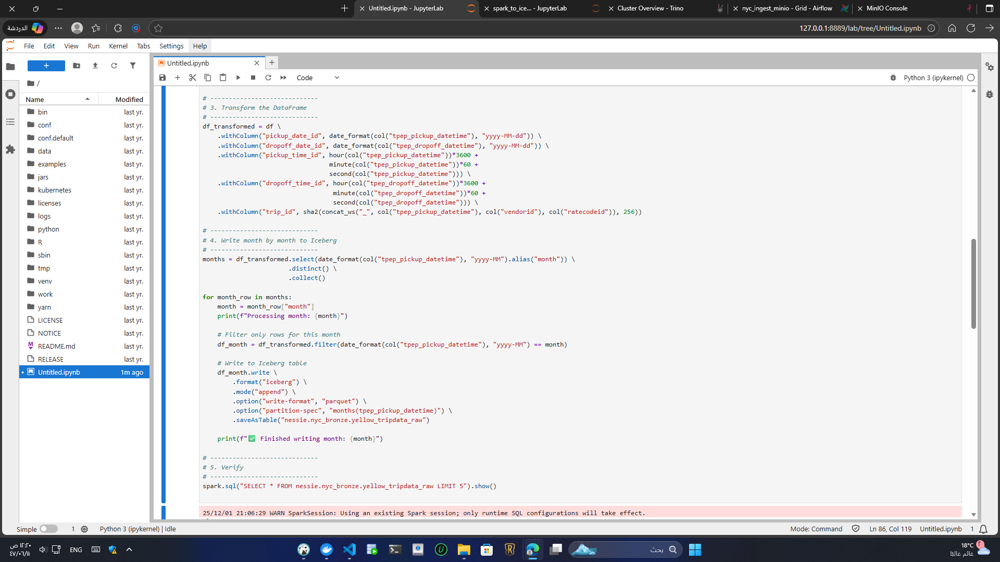

---
## Trino

Trino is used as the SQL query engine for dbt.

Iceberg + Nessie configuration (stored in `iceberg.properties`):

```
connector.name=iceberg
iceberg.catalog.type=nessie
iceberg.nessie-catalog.uri=http://nessie:19120/api/v2
iceberg.nessie-catalog.ref=main
iceberg.nessie-catalog.default-warehouse-dir=s3://lakehouse

fs.native-s3.enabled=true
s3.endpoint=http://minio:9000
s3.region=us-east-1
s3.path-style-access=true
s3.aws-access-key=admin
s3.aws-secret-key=password
```

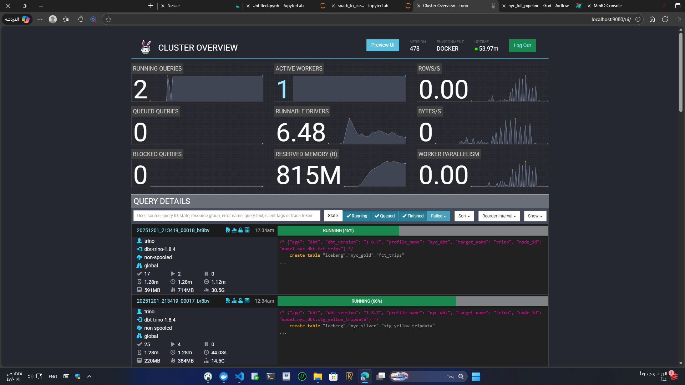
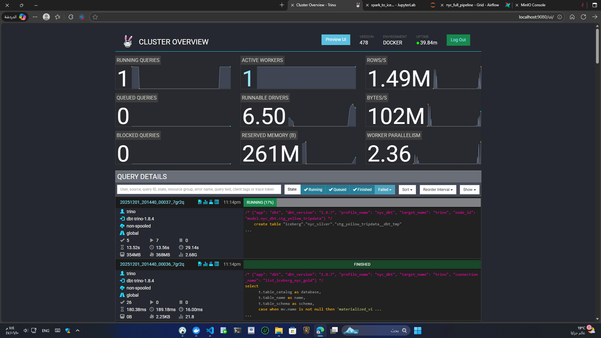
---
## dbt

dbt is used to model the **Silver** and **Gold** layers.

`profiles.yml` example:

```yaml
nyc_dbt:
  target: trino
  outputs:
    trino:
      type: trino
      method: none
      user: trino
      password: ""
      host: trino
      port: 8080
      catalog: iceberg
      schema: "nyc"
      threads: 4
```

Ensure folder names match the values in `dbt_project.yml`.

---
## Airflow

Airflow orchestrates:

* Downloading Parquet files
* Uploading to MinIO
* Checking if tables exist in Iceberg
* Running dbt models and tests

If the Iceberg table does not exist, a message is shown in the DAG logs.

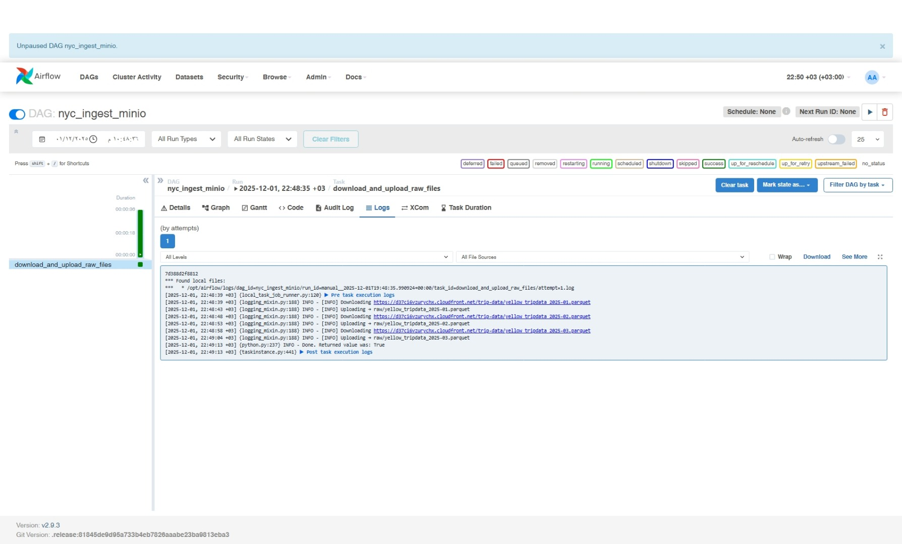

Trino connection configuration:

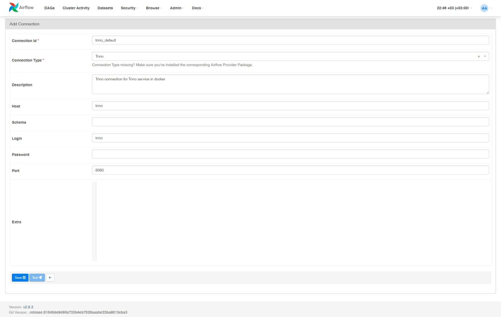

Full DAG:

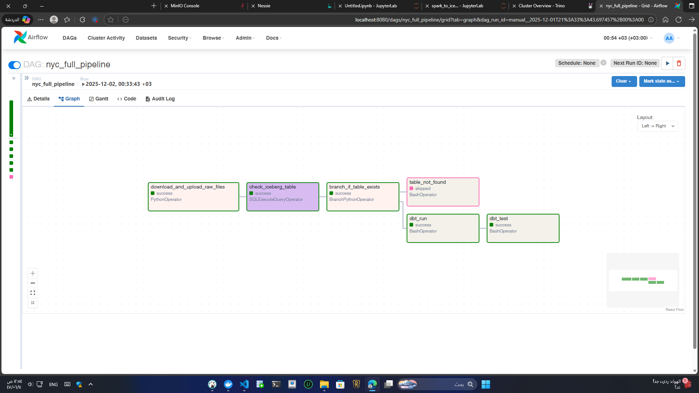

---
## Superset

Superset provides dashboards for visualization.

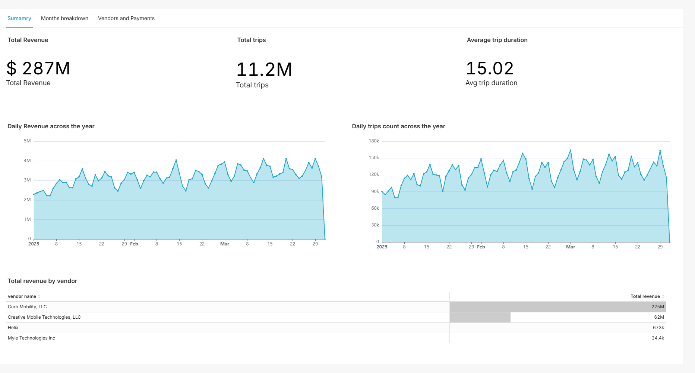
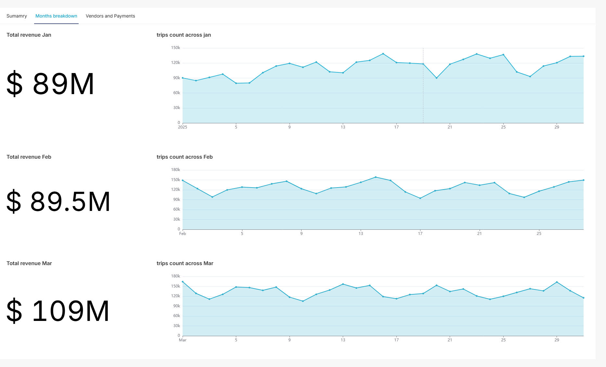
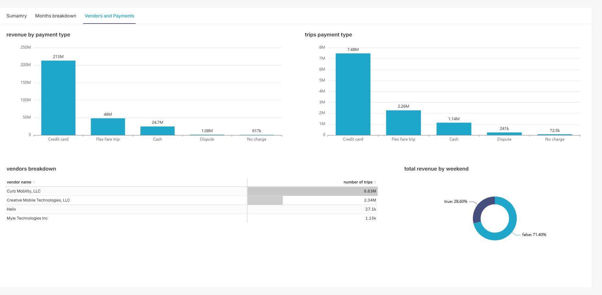

A PostgreSQL database is automatically initialized for Superset using `docker-entrypoint-initdb.d`.

Trino connection example:


Custom datasets created for dashboards:

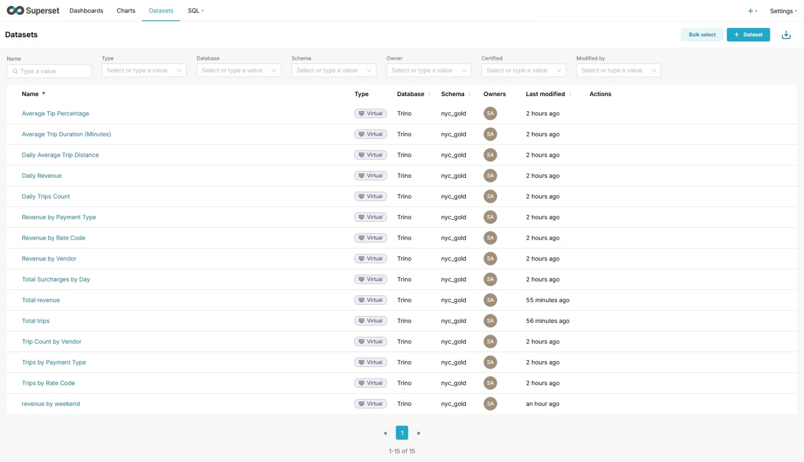

---
## Features

* End-to-end pipeline from raw ingestion to dashboards
* **Spark transformations** on millions of rows
* **Iceberg tables** with Nessie versioning
* **dbt models** for transformation and lineage
* **Superset** dashboards
* **Shell scripts** to manage the entire platform

---

## Installation & Setup

### 1. Clone the repository

```bash
git clone https://github.com/oelghareeb/nyc-tlc-lakehouse.git
cd nyc-tlc-lakehouse
```

### 2. Start the platform

```bash
./run_data_platform.sh up
```

### 3. Stop the platform

```bash
./run_data_platform.sh down
```

### 4. Access services

| Service   | URL / Command                                    |
| --------- | ------------------------------------------------ |
| Superset  | [http://localhost:8088](http://localhost:8088)   |
| Nessie UI | [http://localhost:19120](http://localhost:19120) |
| Airflow UI| [http://localhost:8080]((http://localhost:8080)) |
| MinIO UI  | [http://localhost:9000]((http://localhost:9000)) |
| Trino UI  | [http://localhost:9080]((http://localhost:9080)) |
| Spark UI  | [http://localhost:8181]((http://localhost:8181)) |
| Jupyter   | [http://localhost:8889]((http://localhost:8889)) |

the token for jupyter will be in the container logs


## Data Sources

* **NYC TLC Trip Records**
  [https://www1.nyc.gov/site/tlc/about/tlc-trip-record-data.page](https://www1.nyc.gov/site/tlc/about/tlc-trip-record-data.page)
* **Sample used:** 3 months (~11M rows)

---

## What I Learned

* Designing a Medallion Lakehouse
* Heavy data processing with Spark
* Working with Iceberg + Nessie versioned tables
* Modeling data using dbt
* Creating dashboards in Superset
* Automating pipelines with shell scripts
* Experimenting with Dremio as an additional SQL engine

---
## Important Notes

* Bitnami images are now under `bitnamilegacy`—many tutorials still reference old names.
* Docker networks can conflict; a custom network was created and both Compose files were attached to it.
* Inside Docker, services can communicate using **service names**, not container names or IPs.
* Some images (e.g., Superset) use Python virtual environments; follow official documentation when installing Python packages:

  ```dockerfile
  RUN . /app/.venv/bin/activate &&
  ```
* Airflow currently has compatibility issues with Spark; downgraded to **Airflow 2.9.3**.
* When integrating a service with Airflow, always check:

  * Version compatibility
  * Python version
  * Dependency compatibility

---

## References

* Apache Spark — [https://spark.apache.org/docs/latest/](https://spark.apache.org/docs/latest/)
* Apache Iceberg — [https://iceberg.apache.org/](https://iceberg.apache.org/)
* Project Nessie — [https://projectnessie.org/](https://projectnessie.org/)
* dbt — [https://docs.getdbt.com/docs/introduction](https://docs.getdbt.com/docs/introduction)
* Apache Superset — [https://superset.apache.org/docs/intro](https://superset.apache.org/docs/intro)
* MinIO — [https://min.io/docs/](https://min.io/docs/)
* NYC TLC Trip Records — [https://www1.nyc.gov/site/tlc/about/tlc-trip-record-data.page](https://www1.nyc.gov/site/tlc/about/tlc-trip-record-data.page)

---

## Future Improvements

* Add automated tests and monitoring
* Expand dbt lineage and documentation
* Add Great Expectations for data validation

---

## Author

**Omar Mohamed Elgharib**

* GitHub: [https://github.com/oelghareeb](https://github.com/oelghareeb)
* LinkedIn: [https://linkedin.com/in/omar-mohamed-elgharib](https://linkedin.com/in/omar-mohamed-elgharib)
* Email: [oelghareeb@gmail.com](mailto:oelghareeb@gmail.com)

---
